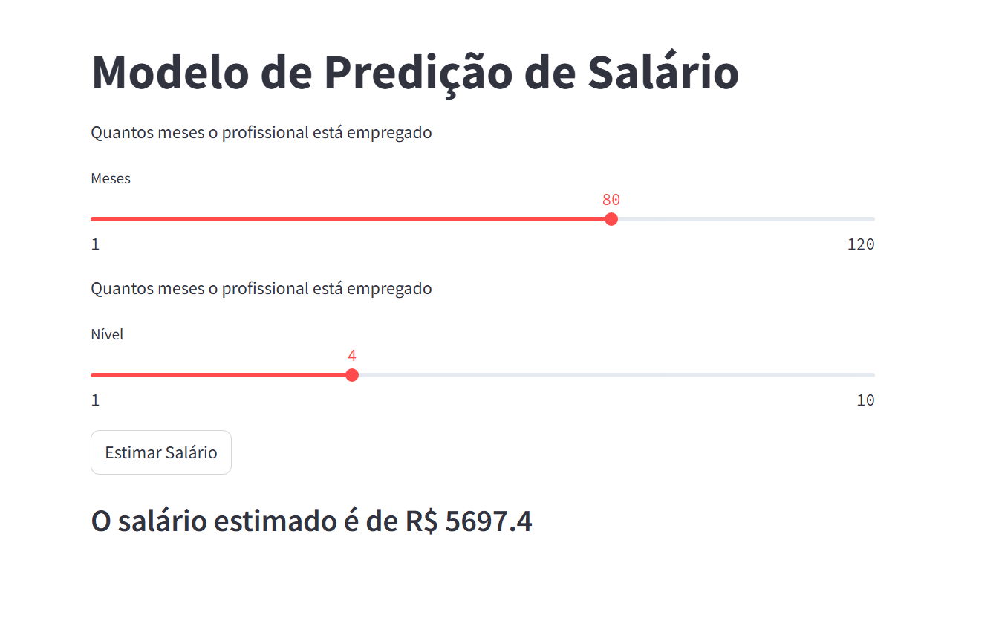

# Modelo de Predição de Salário

---



---

## Tecnologias Utilizadas

### Linguagem de Programação
- [Python](https://www.python.org/) (v3.11.0)

### Gerenciadores de Ambiente Virtual
- [Pyenv](https://github.com/pyenv/pyenv)
- [Pipenv](https://pipenv.pypa.io/en/latest/)

### Principais Bibliotecas (Packages)
#### Exploração e Análise de Dados (EAD)
- [pandas](https://pandas.pydata.org/)
- [seaborn](https://seaborn.pydata.org/)
- [matplotlib](https://matplotlib.org/)
- [pingouin](https://pingouin-stats.org/)

#### Treinamento do Modelo
- [numpy](https://numpy.org/)
- [scikit-learn](https://scikit-learn.org/stable/)
- [scipy](https://scipy.org/)
- [joblib](https://joblib.readthedocs.io/en/latest/)

#### Criação de Interface e API
- [Streamlit](https://streamlit.io/)
- [FastAPI](https://fastapi.tiangolo.com/)
- [Uvicorn](https://www.uvicorn.org/)

---

## Visão Geral do Projeto

Este projeto tem como objetivo criar um modelo de predição para calcular o salário de um colaborador com base em variáveis como **Tempo na Empresa** e **Nível na Empresa**. O modelo foi desenvolvido utilizando regressão linear polinomial e implementado com uma interface interativa utilizando **Streamlit** e uma **API FastAPI** para o backend.

### Principais Etapas do Projeto:

1. **Exploração de Dados**:
    - Realização de análise exploratória utilizando gráficos de dispersão, histogramas e boxplots.
    - Análise estatística para entender a distribuição e correlação entre as variáveis.

2. **Construção e Treinamento do Modelo**:
    - Implementação de um modelo de regressão linear polinomial para prever o salário com base nas variáveis fornecidas.
    - Uso de **Pipelines** para normalização dos dados com **StandardScaler** e transformação polinomial com **PolynomialFeatures**.
    - Avaliação do modelo utilizando **R² Score** e **Mean Squared Error**.

3. **Desenvolvimento da Interface e API**:
    - Criação de uma API com **FastAPI** para processar requisições e prever o salário.
    - Desenvolvimento de uma interface interativa com **Streamlit**, conectada à API para visualização e interação com os resultados.

---

## Como Executar o Projeto

**Pré-requisitos**:
- Certifique-se de que o **Python** esteja instalado em sua máquina. Caso contrário, baixe em [python.org](https://www.python.org/downloads/).

### Instalação do Projeto

1. Clone o repositório:
    ```bash
    git clone https://github.com/seu-usuario/modelo_predicao_salario.git
    cd modelo_predicao_salario
    ```

2. Configure o ambiente virtual com `pipenv`:
    ```bash
    pipenv install
    pipenv shell
    ```

### Executando a API (Backend)

1. Inicie o servidor FastAPI:
    ```bash
    uvicorn api_modelo_salario:app --reload
    ```

2. Acesse a documentação da API (Swagger) em:
    ```bash
    http://127.0.0.1:8000/docs
    ```

### Executando a Interface (Frontend)

1. Execute o Streamlit:
    ```bash
    streamlit run app_streamlit_salario.py
    ```

2. Acesse a interface localmente:
    ```bash
    http://127.0.0.1:8501
    ```

---

## Funcionalidades Implementadas

### Modelo de Machine Learning
- Criação de um modelo de regressão linear polinomial para prever o salário com base no **Tempo na Empresa** e **Nível na Empresa**.
- Avaliação com métricas como **R² Score** e **MSE** para garantir a qualidade das predições.

### Análise Estatística
- Verificação da normalidade dos dados utilizando:
    - **Shapiro-Wilk**, **Kolmogorov-Smirnov**, **Lilliefors**, entre outros testes.
- Análise gráfica com histogramas e scatter plots para entender a relação entre as variáveis.

### Interface com Streamlit
- Interface interativa que permite aos usuários inserir os valores das variáveis de entrada.
- Conexão com a API FastAPI para processar e exibir a predição em tempo real.

### API com FastAPI
- Endpoint para predição do salário com base nos valores enviados pelo usuário.
- Documentação gerada automaticamente com Swagger.

---

## 👨‍💼 Autor

<table>
  <tr>
    <td align="center">
      <a href="#">
        <br>
        <sub>
          <b>Gian Dutra</b>
        </sub>
      </a>
    </td>
  </tr>
</table>
